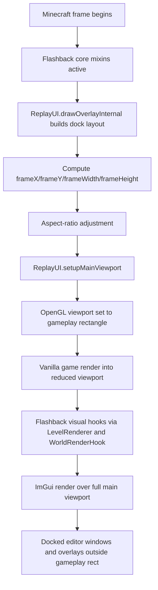
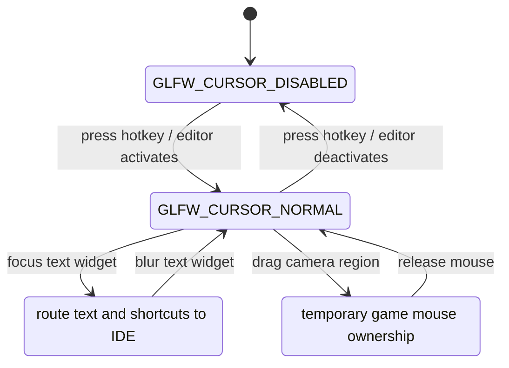

# Flashback Rendering and Input Pattern for an In-Game IDE

## Executive Summary

The strongest conclusion from the accessible primary code is that Flashback’s editor UI is built around a **single authoritative gameplay rectangle** managed by `ReplayUI`, not around a fully separate “game texture inside a widget” renderer. `ReplayUI.drawOverlayInternal()` creates a docked ImGui layout, computes `frameX`, `frameY`, `frameWidth`, and `frameHeight` from the central dock node, optionally enforces aspect-ratio rules, and then `ReplayUI.setupMainViewport()` applies that rectangle to the OpenGL viewport with `GlStateManager._viewport(...)`. The same class also remaps mouse coordinates into that rectangle and triggers `Minecraft.resizeDisplay()` when the editor activates or deactivates. That is the core of the sub-viewport effect. citeturn30view0turn28view0

The second strong conclusion is that Flashback keeps rendering **editor chrome and editor-specific overlays outside the reduced gameplay rectangle** by continuing to render Dear ImGui over the full main viewport and by injecting additional visual passes through rendering mixins and `WorldRenderHook`. In the accessible sources, I found direct evidence for full-window ImGui rendering and clipping, and secondary-but-source-linked evidence that `visuals.MixinLevelRenderer` calls into `WorldRenderHook` for camera paths and replay markers. I did **not** find equally direct proof, in the accessible interface, that ordinary vanilla entities are intentionally redrawn outside the reduced viewport; the safer reading is that Flashback shrinks the main game pass, then renders Flashback/ImGui chrome and hook-based visuals afterward across the full window. citeturn30view0turn44view0turn44view1turn44view3turn62view0

For your in-game IDE goal, Flashback is most valuable as a pattern for **cursor undocking, mouse-coordinate remapping, central-rect ownership, and full-window editor composition**. The accessible code shows explicit cursor release / recapture behavior, frame-relative mouse remapping, inverse-projection mouse-to-world math, and GLFW-style cursor mode control that maps cleanly onto a “press `\` to undock the cursor but keep rendering and handling keys” design. citeturn28view0turn30view0turn27view3turn55search6

## Repository and Version Context

The repository is hosted on entity["company","GitHub","code hosting platform"] and is a client-side mod for entity["video_game","Minecraft","sandbox game 2011"]. At repository head, `gradle.properties` pins `minecraft_version=26.1`, `loader_version=0.18.5`, and `fabric_version=0.145.0+26.1`, while `build.gradle` uses `net.fabricmc.fabric-loom` `1.15-SNAPSHOT` and a Java 25 toolchain. Separately, `fabric.mod.json` declares a client-only environment and a dependency floor of `minecraft >=1.21.11`, `java >=21`, and `fabric-api >=0.107.0`. Fabric’s current Loom documentation says the `net.fabricmc.fabric-loom` plugin id is used for “Minecraft 26.1 or newer,” and Fabric’s mappings documentation says Minecraft `26.1` is unobfuscated, so head-of-repo appears to target the post-obfuscation-removal era rather than a classic Yarn-mapped branch. citeturn20view0turn21view0turn61view0turn55search0turn55search3

The mod’s client integration surface is broad. `flashback.mixins.json` registers `MixinMinecraft`, `MixinMouseHandler`, `MixinRenderTarget`, `MixinWindow`, `playback.MixinGameRenderer`, `MixinLevelRenderer`, and multiple `visuals.*` mixins on the client side. That registration does not by itself prove behavior, but it is important architectural evidence: Flashback has explicit injection points for window sizing, render-target handling, mouse input, the game renderer, and level rendering—the exact surfaces one would expect for a sub-viewport editor. citeturn47view0

## How Flashback Rescales the Gameplay View

`ReplayUI.drawOverlayInternal()` is the center of gravity. It enables ImGui docking with `dockSpaceOverViewport`, opens a `Main` docked window, computes its content region, and stores that content box as `frameX`, `frameY`, `frameWidth`, and `frameHeight`. It then applies aspect-ratio logic for `Sizing.KEEP_ASPECT_RATIO` and `Sizing.CHANGE_ASPECT_RATIO`, shrinking either width or height so the gameplay rectangle matches the desired editor visual ratio. This is the code that turns “remaining central dock space” into “the gameplay rectangle.” citeturn30view0

The actual OpenGL resize step is explicit. `ReplayUI.setupMainViewport()` computes pixel-space coordinates relative to the native window and then calls `GlStateManager._viewport(...)` with the frame rectangle. In other words, the main game pass is not merely *drawn inside a window-looking widget*; Flashback directly changes the OpenGL viewport for the game pass. OpenGL’s `glViewport` maps normalized device coordinates into the specified window-space rectangle, so shrinking this rectangle is enough to make the vanilla render land in the editor’s central pane. citeturn28view0turn56search2

Equally important is what `ReplayUI` does **not** do at this point: in the accessible `ReplayUI.java` source, there is a viewport call but no matching `scissor` call. That matters because a viewport remaps the game pass into a smaller rectangle, while a scissor would additionally mask later pixel writes. Flashback’s accessible code suggests it wants the game pass shrunk, but it does **not** globally fence off the rest of the framebuffer at the `ReplayUI` layer. citeturn28view0turn27view1turn56search5

The bridge to vanilla GUI scaling appears to be split between `ReplayUI` and client mixins. `ReplayUI` exposes `getNewGameWidth(scale)`, `getNewGameHeight(scale)`, `getNewMouseX(x)`, and `getNewMouseY(y)`, and it forces `Minecraft.resizeDisplay()` whenever the editor’s active state changes. Meanwhile, the client mixin list includes `MixinWindow`, `MixinRenderTarget`, and `MixinMouseHandler`. The accessible interface did not let me retrieve those mixin bodies directly, so the exact implementation cannot be quoted here, but the evidence strongly supports this contract: `ReplayUI` owns the rectangle, and the mixins likely make vanilla window size, render-target size, and mouse-space logic consume that rectangle so the main game view **and the vanilla in-game UI** scale together inside it. I consider that a well-supported inference, not a directly quoted fact. citeturn28view0turn30view0turn47view0

The implied render order looks like this. The diagram is not copied from the repo; it is a reconstruction from the accessible call sites and source-linked mixin documentation. citeturn30view0turn28view0turn62view0turn62view1



## How Rendering Continues Outside the Gameplay Rectangle

Flashback’s editor windows are full-screen ImGui composition layers, not part of the game viewport. `ReplayUI.drawOverlayInternal()` calls `dockSpaceOverViewport` on the main ImGui viewport, uses a central `Main` dock node as the gameplay space, and then continues to render editor windows, status overlays, and guide lines through ImGui draw lists. Because that ImGui composition happens at the Dear ImGui layer over the entire main viewport, editor panels can exist outside the reduced game rectangle without requiring the vanilla game to know anything about them. citeturn30view0

The `Sizing.UNDERLAY` path makes this especially explicit. After the editor has already computed the central gameplay rectangle, `ReplayUI` checks for `Sizing.UNDERLAY` and, in that mode, resets `frameX=0`, `frameY=0`, and `frameWidth/frameHeight` to the full screen size before drawing guide overlays. The result is that at least some Flashback overlays are intentionally allowed to ignore the reduced viewport and operate over the full window. That is a concrete, direct example of “render something outside the rescaled viewport.” citeturn29view5turn30view0

The ImGui renderer itself also proves that later passes are operating on the full framebuffer. `CustomImGuiImplGl3` sets `glViewport(0, 0, fbWidth, fbHeight)` for ImGui draw data, enables `GL_SCISSOR_TEST`, uses `glScissor(...)` per draw command, and restores the previous viewport and scissor box afterward. In other words, Flashback uses **viewport remapping for the game pass**, but **viewport + scissor clipping for ImGui draw lists**. That separation is architecturally clean and is exactly what you would want in an in-game IDE: the game gets one sub-viewport, and the editor compositor gets the full framebuffer with its own clipping. citeturn44view0turn44view1turn44view2turn44view3

Flashback also contains an explicit framebuffer utility layer, but the accessible source suggests it is an auxiliary rendering utility, not the primary mechanism behind the editor’s main split-view layout. `FramebufferUtils` can allocate or resize a `TextureTarget`, clear color/depth attachments, build an orthographic projection, write a custom `RenderPass`, and partially blit a source render target to the screen via a temporary framebuffer. That is powerful enough for preview panes, screen-space composition, or export helpers. But in the accessible `ReplayUI` source there is no direct framebuffer usage in the main editor layout path, which reinforces the idea that the editor UI is mainly “sub-viewport + overlays,” not “world rendered into an offscreen widget texture every frame.” citeturn12view0turn13view0turn27view4

For world-space visuals beyond vanilla world rendering, DeepWiki’s source-linked rendering documentation identifies `visuals.MixinLevelRenderer` and `WorldRenderHook` as the path used to draw camera paths and replay markers. That is the best accessible evidence for Flashback-specific 3D visuals continuing after or alongside the normal world pass. Because those sources are source-linked but not directly retrievable here, I treat them as reliable for location and purpose, but less authoritative than the directly inspected `ReplayUI` and `CustomImGuiImplGl3` code above. citeturn62view0

## Input Capture and Cursor Undocking

Your “press `\` to undock the mouse but keep rendering and still handle keys” requirement is very close to what Flashback already does. `ReplayUI.transitionActiveState(...)` first calls `Minecraft.resizeDisplay()` to recalculate sizes, then `imguiGlfw.ungrab()`. When leaving editor-active mode, it restores vanilla mouse grab state by calling `releaseMouse()` and `grabMouse()` in the order appropriate for `screen == null` versus GUI mode, then calls `setIgnoreFirstMove()`. When entering editor-active mode, it forcefully sets the GLFW cursor mode for the main viewport window back to `GLFW_CURSOR_NORMAL` and re-centers the cursor if it had been grabbed. GLFW’s own docs describe `GLFW_CURSOR_NORMAL` as visible/unrestricted and `GLFW_CURSOR_DISABLED` as hidden-and-grabbed. That is almost exactly the toggle semantics you want. citeturn30view0turn27view3turn55search6

Flashback also remaps mouse coordinates into the gameplay rectangle instead of pretending the game still fills the whole screen. `ReplayUI.getNewMouseX(x)` returns `x - frameX`, `getNewMouseY(y)` returns `y - frameY`, and `getMouseViewportFraction(...)` normalizes positions by `frameWidth` and `frameHeight`. For camera-relative picking, `getForwardsVectorRaw()` inverts the last stored projection matrix and combines it with the last stored view quaternion to convert a frame-relative mouse position into a world-space look vector. That means Flashback’s input pipeline is not just about cursor visibility; it is explicitly **sub-viewport aware**. citeturn28view0turn31view0turn31view1

The accessible code also shows the policy layer for keyboard handling. `ReplayUI.drawOverlayInternal()` calls `imguiGlfw.updateReleaseAllKeys(...)`, toggles ImGui keyboard navigation flags when popups are open, checks Escape handling through ImGui navigation state, and distinguishes between “frame hovered” and “moving camera” using `imguiGlfw.isGrabbed()` and `getMouseHandledBy() == GAME`. I could not directly inspect `CustomImGuiImplGlfw`’s callback bodies through the available interface, so I cannot claim the exact event-listener implementation, but the call sites clearly show an input backend that can decide whether mouse/keys belong to the game or the editor at any moment. citeturn30view0turn28view0turn27view5

The state machine implied by the code is this. Again, the diagram is an analytical reconstruction, not a repository artifact. citeturn30view0turn27view3turn55search6



## Feature-to-Code Map

| Feature | File / class / method | Line range | Short explanation |
|---|---|---:|---|
| Central gameplay rectangle calculation | `src/main/java/com/moulberry/flashback/editor/ui/ReplayUI.java` • `ReplayUI.drawOverlayInternal()` | `3217-3308` | Creates dock space over the main viewport, opens the central `Main` window, extracts the content box into `frameX/Y/Width/Height`, and applies aspect-ratio correction. citeturn30view0 |
| Apply reduced game viewport | `src/main/java/com/moulberry/flashback/editor/ui/ReplayUI.java` • `ReplayUI.setupMainViewport()` | `2913-2925` | Converts frame coordinates into native window pixels and calls `GlStateManager._viewport(...)`. This is the direct sub-viewport hook. citeturn28view0 |
| Mouse-space remapping for sub-viewport | `src/main/java/com/moulberry/flashback/editor/ui/ReplayUI.java` • `getNewMouseX/Y`, `getMouseViewportFraction`, `getForwardsVectorRaw` | `2795-2853`, `2940-2959` | Rewrites mouse coordinates relative to the gameplay rectangle and inverts the projection matrix for world-space picking. citeturn28view0turn31view0turn31view1 |
| Cursor undock / recapture policy | `src/main/java/com/moulberry/flashback/editor/ui/ReplayUI.java` • `transitionActiveState()` | `3011-3069` | Recalculates display size, ungrabs ImGui, restores/forces vanilla mouse grab state, and explicitly sets the GLFW cursor to normal when editor mode is active. citeturn30view0turn55search6 |
| Full-window overlay mode | `src/main/java/com/moulberry/flashback/editor/ui/ReplayUI.java` • `drawOverlayInternal()` | `3370-3409` | In `Sizing.UNDERLAY`, resets the frame rectangle to full-screen before drawing guides, allowing overlays outside the reduced gameplay rect. citeturn29view5turn30view0 |
| ImGui compositor viewport/scissor | `src/main/java/com/moulberry/flashback/editor/ui/CustomImGuiImplGl3.java` • `setupRenderState()` / `renderDrawData()` | roughly `2632-2690`, `2912-2914`, `3020-3022` | Sets full-framebuffer viewport, enables scissor test for Dear ImGui clipping, and restores previous viewport/scissor afterward. citeturn44view0turn44view1turn44view2turn44view3 |
| Custom framebuffer and partial blit utility | `src/main/java/com/moulberry/flashback/FramebufferUtils.java` • `clear`, `resizeOrCreateFramebuffer`, `blitTo`, `blitToScreenPartial` | `33-48`, `61-110` | Allocates/resizes `TextureTarget`, clears attachments, sets an orthographic projection, issues a custom `RenderPass`, and partially blits to screen through a temporary render target. citeturn13view0turn12view0 |
| Rendering hook for Flashback-specific world visuals | `src/main/java/com/moulberry/flashback/mixin/visuals/MixinLevelRenderer.java` and `src/main/java/com/moulberry/flashback/visuals/WorldRenderHook.java` | `32-73`, `20-85` | Source-linked documentation identifies this path as the integration point for camera paths and replay markers. citeturn62view0 |
| Visibility control over vanilla render elements | `src/main/java/com/moulberry/flashback/mixin/MixinLevelRenderer.java` | `94-101`, `172-193`, `113-142` | Source-linked docs show hook points that selectively control entities, players, particles, sky, clouds, and export transparency. citeturn62view0 |
| Core integration hub | `src/main/java/com/moulberry/flashback/mixin/MixinMinecraft.java` | `79-460`, with notable spans `183-195`, `243-344`, `407-459` | Source-linked docs place replay timing, export coordination, and replay-server startup here; this is the central runtime integration mixin. citeturn62view1 |
| Registered bridge mixins for viewport/input plumbing | `src/main/resources/flashback.mixins.json` | client mixin array | Registers `MixinMouseHandler`, `MixinRenderTarget`, `MixinWindow`, `MixinMinecraft`, `MixinLevelRenderer`, and `playback.MixinGameRenderer`, which is exactly the set expected for sub-viewport and input integration. citeturn47view0 |

## What This Means for Your In-Game IDE

If your IDE should live inside the game window, the Flashback pattern to copy is **not** “render the world to a texture widget first.” The more robust pattern is: keep one canonical editor-owned rectangle for gameplay, feed that rectangle into the game’s logical size and mouse-coordinate path, apply a reduced OpenGL viewport for the world pass, then restore full-window composition for the editor layer. That is why Flashback can undock the cursor, keep drawing, and still maintain sensible camera picking and viewport-relative interaction. citeturn30view0turn28view0turn31view0

For your `\` hotkey specifically, I would mirror Flashback’s semantics and make the hotkey toggle a small ownership state machine rather than a one-off flag. In the “captured” state, use `GLFW_CURSOR_DISABLED` and route mouse deltas to the game camera. In the “editor free” state, use `GLFW_CURSOR_NORMAL`, keep the game rendering into the reduced viewport, and continue routing keyboard events globally—with priority to the IDE if a text/editor widget is focused, otherwise to the game or shared shortcuts. Flashback shows that the cursor mode switch and display resize belong together. GLFW’s documented cursor modes are the correct primitive for this. citeturn30view0turn55search6

A minimal architecture sketch, adapted from the Flashback pattern, would look like this:

```java
// global editor state
boolean ideActive = false;
Rect gameRect = new Rect(320, 40, 1280, 720); // editor-owned central pane

void toggleIdeCursor() {
    ideActive = !ideActive;

    long handle = Minecraft.getInstance().getWindow().getWindow();
    int mode = ideActive ? GLFW.GLFW_CURSOR_NORMAL : GLFW.GLFW_CURSOR_DISABLED;
    GLFW.glfwSetInputMode(handle, GLFW.GLFW_CURSOR, mode);

    Minecraft.getInstance().resizeDisplay();
}

double mapMouseX(double x) { return x - gameRect.x(); }
double mapMouseY(double y) { return y - gameRect.y(); }

void beforeWorldRender() {
    Window w = Minecraft.getInstance().getWindow();
    int px = gameRect.x() * w.getWidth() / w.getScreenWidth();
    int py = (w.getScreenHeight() - (gameRect.y() + gameRect.h())) * w.getHeight() / w.getScreenHeight();
    int pw = Math.max(1, gameRect.w() * w.getWidth() / w.getScreenWidth());
    int ph = Math.max(1, gameRect.h() * w.getHeight() / w.getScreenHeight());
    GlStateManager._viewport(px, py, pw, ph);
}

void afterWorldRender() {
    // restore full framebuffer composition for IDE
    GL11.glViewport(0, 0,
        Minecraft.getInstance().getWindow().getWidth(),
        Minecraft.getInstance().getWindow().getHeight());

    renderIdeWindows();
}
```

That sketch follows the same design ideas visible in `ReplayUI.setupMainViewport()`, `transitionActiveState()`, and Flashback’s ImGui compositor. The one thing you still need beyond this sketch is the vanilla bridge layer that makes the game think its logical view is `gameRect` rather than the full window; Flashback appears to solve that with the registered `MixinWindow`, `MixinRenderTarget`, and `MixinMouseHandler` combination, but their method bodies were not directly retrievable here, so I would implement your own bridging mixins explicitly rather than depend on guesswork. citeturn28view0turn30view0turn47view0

The most practical recommendation for your use case is to keep **keyboard handling global even when the cursor is free**. Flashback’s call sites indicate keyboard ownership can be toggled independently of mouse ownership through its ImGui input backend. For an IDE, that means the safest model is: mouse ownership follows hover/focus; keyboard ownership follows explicit text-focus / command-palette / editor-focus state; the `\` hotkey itself should always be on a global path that is not swallowed by the IDE text layer. citeturn30view0

## Evidence Boundaries and the Safest Interpretation

Two parts of the mechanism are directly proven by accessible code: the central-frame computation plus OpenGL viewport rewrite in `ReplayUI`, and the full-window Dear ImGui composition with its own scissor/viewport management. Those are enough to explain **why Flashback can look like a native in-game editor instead of a pause-menu overlay**. citeturn30view0turn28view0turn44view0turn44view1turn44view3

The exact way vanilla GUI scale, render-target size, and mouse handler are coerced into that reduced rectangle is only partially visible here. The registered client mixins tell us *where* that logic almost certainly lives, and `ReplayUI` exposes exactly the helper methods those mixins would need, but I was not able to directly inspect the source bodies of `MixinWindow`, `MixinRenderTarget`, `MixinMouseHandler`, or `playback.MixinGameRenderer` through the available interface. So the safest rigorous statement is: Flashback’s accessible code proves the editor-owned frame, viewport rewrite, cursor control, and full-window composition model; the last-mile vanilla plumbing is a high-confidence inference from the registered mixin surfaces and `ReplayUI`’s contract. citeturn47view0turn28view0turn30view0

I also did not find direct evidence, in the accessible interface, that Flashback redraws **ordinary vanilla entities** outside the reduced viewport. What I did find is a render hook path for Flashback-specific world visuals (`WorldRenderHook`) and a compositor path for full-window editor overlays. If your target behavior is “keep the world in a pane, but allow some editor visuals or helper renders outside the pane,” the accessible evidence fully supports that pattern. If your target is “draw the same vanilla world/entities both inside and outside the pane,” that specific behavior is **not** established by the sources I could directly inspect. citeturn62view0turn30view0

## Suggested Validation Tests

The quickest validation sequence for your own IDE implementation is to test the mechanism in stages, not all at once. First, shrink the game with a viewport-only pass and draw a bright border around the intended gameplay rectangle; verify that world rendering lands inside the pane and that later IDE rendering still fills the full framebuffer. Next, add cursor-mode toggling on `\` and verify the exact GLFW transitions between `GLFW_CURSOR_DISABLED` and `GLFW_CURSOR_NORMAL`. Then add mouse remapping and confirm that picking/raycasting remains accurate only when using frame-relative coordinates. Finally, add keyboard routing while the cursor is free and verify that the IDE can keep typing shortcuts and text even when the mouse is outside the game pane. Those tests are direct extensions of the mechanisms visible in Flashback’s `ReplayUI` and ImGui backend. citeturn28view0turn30view0turn44view0turn55search6

A minimal test matrix that will catch most bugs is: “toggle while mousing the camera,” “toggle while a text editor widget is focused,” “toggle with the cursor outside the gameplay pane,” “resize the main window while editor mode is active,” and “switch between aspect-ratio modes and full-window underlay mode.” Flashback’s code makes all of those risk points visible: it explicitly guards first mouse movement after recapture, recomputes display size on active-state transitions, enforces aspect-ratio constraints, and has a separate underlay mode that bypasses the reduced frame for some overlays. citeturn30view0turn29view5